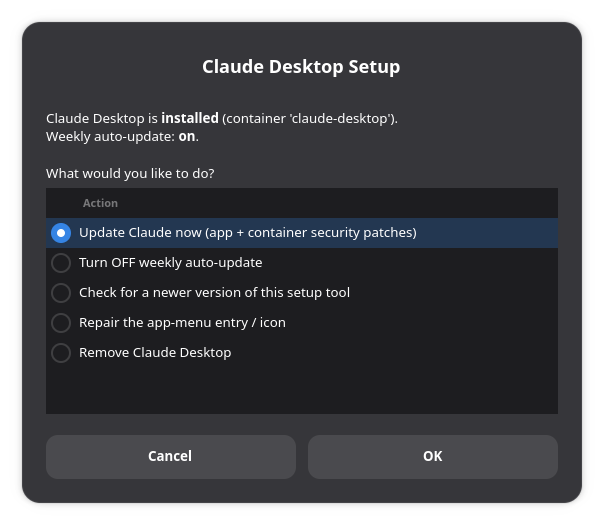

# Claude Desktop on Fedora (via distrobox) — privacy-hardened

Run **Anthropic's official Claude Desktop app** on Fedora / RHEL-family Linux, where it isn't
officially supported yet — using [distrobox](https://distrobox.it/) and an Ubuntu container,
with sensible **privacy isolation** on top.

Anthropic ships an official Linux build, but only for **Debian/Ubuntu** (Fedora & RHEL are
explicitly "coming later"). This project installs that *genuine, GPG-signed* app inside a
lightweight Ubuntu container and wires it into your Fedora desktop — app-menu entry, `claude://`
sign-in, the works — while keeping it out of your real home directory and off your host network.

> **Not affiliated with Anthropic.** This is a community wrapper around the *official* app.
> It installs Anthropic's own signed `.deb` from Anthropic's own apt repository — no
> repackaging, no third-party binaries.

---

## Contents

- [How is this different?](#how-is-this-different)
- [Why](#why)
- [How it works](#how-it-works)
- [Security &amp; trust model](#security--trust-model)
- [Easy install (Fedora, GUI)](#easy-install-fedora-gui)
- [Requirements](#requirements)
- [Install from source (advanced)](#install-from-source-advanced)
- [Use it](#use-it)
- [Update it](#update-it)
- [Remove it](#remove-it)
- [Command reference](#command-reference)
- [Under the hood: the auto-update timer](#under-the-hood-the-auto-update-timer)
- [Releasing (maintainers)](#releasing-maintainers)
- [Troubleshooting](#troubleshooting)
- [Limitations &amp; honest caveats](#limitations--honest-caveats)
- [Contributing &amp; security reports](#contributing--security-reports)

---

## How is this different?

There are several ways to get Claude Desktop onto Fedora. Most of them **unpack Anthropic's `.deb`
and repackage it** as an RPM, a Flatpak, or a snap. That works, but it means you're running a
binary that someone else rebuilt, on a release schedule that someone else keeps up with.

| | Repackaged RPM / Flatpak / snap | **This project** |
|---|---|---|
| **What you run** | A third party's rebuild of Anthropic's app | Anthropic's **own signed `.deb`**, installed unchanged from Anthropic's apt repo, key fingerprint verified first |
| **Updates** | Whenever the packager gets around to it | **Anthropic's release channel**, directly — new versions arrive the moment Anthropic ships them, on a weekly timer if you want |
| **Access to your home** | Usually everything (Flatpak: depends on the manifest) | **Real home hidden.** Sandbox home + `~/Documents`/`~/Pictures`/`~/Desktop` read-only, `~/Downloads` read-write, nothing else |
| **Host network** | Shared | **Own network namespace** — can't talk to `localhost` services |
| **Root at runtime** | Varies | **None** — rootless podman, user-level launcher and timer |

If you just want the app and don't care about any of that, a repackaged build is fine and simpler.
This project is for people who want the **genuine build, the official update path, and a
least-privilege setup** — and are willing to have ~1 GB of Ubuntu container for it.

## Why

- Claude Desktop's Linux beta supports **Ubuntu 22.04+/Debian 12+ only** ([official docs](https://code.claude.com/docs/en/desktop-linux)).
- Fedora/RHEL work fine *through a container*. distrobox makes a GUI app in a container feel native.
- distrobox is built for **integration, not isolation** — by default it mounts your whole `$HOME`
  and shares your network. This project deliberately **hardens** that so a networked desktop app
  doesn't get casual read/write to your `~/.ssh`, `~/.gnupg`, browser profiles, and documents.

## How it works

```
  Fedora host                                   Ubuntu 24.04 container (rootless podman)
  ┌───────────────────────────┐                 ┌─────────────────────────────────────┐
  │ ~/.local/bin/claude-desktop│  distrobox enter│  /usr/bin/claude-desktop (official)  │
  │   (generated launcher)  ───┼────────────────▶│  installed from Anthropic's apt repo │
  │ ~/.local/share/applications│                 │  HOME = sandbox dir (real ~ hidden)  │
  │   claude-desktop.desktop   │                 │  own network namespace (pasta)       │
  │ xdg-mime: claude:// ───────┼── OAuth login ─▶│  Wayland/X11 + GPU passed through     │
  └───────────────────────────┘                 └─────────────────────────────────────┘
```

The installer (`install-claude-desktop-distrobox.sh`):

1. **Creates** an `ubuntu:24.04` distrobox container (podman, rootless).
2. **Installs the official app** inside it from `https://downloads.claude.ai/claude-desktop/apt`,
   after **verifying the signing-key fingerprint** *before* the repo is enabled.
3. **Isolates the filesystem.** distrobox always bind-mounts `$HOME`, and its `--home` flag does
   *not* stop that (its documented job is just "avoid littering your home with temp files"). The
   trick used here: run `distrobox create` with `HOME` pointed at a **sandbox dir**
   (`~/.local/share/claude-desktop-box`) while keeping podman's storage vars real. distrobox then
   mounts *the sandbox* as the home and **never mounts your real `/home/you`**.
4. **Isolates the network** with `--unshare-netns`: full outbound internet (to reach Claude), but
   the app can't reach services on your host's `localhost`.
5. **Wires it into your desktop** by generating a host launcher, `.desktop` entry, and icons
   (not `distrobox-export`, which breaks under an isolated home), and registers the app's
   `claude://` URL scheme so browser OAuth sign-in routes back to the containerized app.
   The app's icons are copied out into a real `~/.local/share/icons/hicolor/` theme and the
   window class is pinned so the running window folds into the launcher's dock entry rather
   than appearing beside it as an unknown app.

## Security & trust model

**What you're trusting**

- **Anthropic** — the app and apt repo are theirs; the `.deb` is GPG-signed. The installer pins and
  verifies the fingerprint `31DD DE24 DDFA B679 F42D 7BD2 BAA9 29FF 1A7E CACE`
  (from the [official docs](https://code.claude.com/docs/en/desktop-linux)) and **aborts on mismatch**,
  so a tampered mirror or MITM can't swap the key.
- **distrobox + podman** — mature, widely used, distro-packaged, rootless.

**What the hardening protects**

- ✅ The app's file dialogs, config, cache, and any indexing see **only the sandbox home**, your
  standard user folders (`~/Documents`, `~/Desktop`, `~/Pictures` **read-only**; `~/Downloads`
  read-write — needed so "Attach file" and drag-and-drop work, see below) and folders you
  explicitly `--share`. Your `~/.ssh`, `~/.gnupg`, `~/.mozilla`, browser profiles and everything
  else in your home are not presented to it. Pass `--no-user-dirs` to hide the standard folders too.
- ✅ The container has its **own network namespace** — it can't reach your host's `localhost` services.
- ⚠️ The app is pointed at the host's **system D-Bus** (read-mostly: logind, NetworkManager, UPower)
  so it gets real suspend/resume signals instead of guessing. `--no-system-bus` opts out.
- ✅ Runs **rootless** (no host root; podman user namespaces).

**What it does *not* protect — read this** 🔶

distrobox always mounts the host root at **`/run/host`**, so your real home remains reachable at
`/run/host/home/<you>`. This is **practical least-privilege for a *trusted* app, not a hard sandbox**:
the app has no reason to look there, but a compromised process *could*. For a hard boundary, use a VM.
The isolation here is about *"don't casually hand my whole home to a networked app,"* not
*"sandbox untrusted code."*

> `--no-sandbox` is passed to the app because Chromium's own sandbox needs nested user namespaces
> that typically fail inside a rootless container. The container is the outer boundary. Pass
> `--sandbox` to try keeping Chromium's sandbox (may fail to launch).

## Easy install (Fedora, GUI)

No terminal needed.

<p align="center"></p>

1. Download the latest **`claude-desktop-distrobox-*.noarch.rpm`** from the
   [Releases page](https://github.com/DaveTheGameDev/claude-desktop-fedora-distrobox/releases/latest).
2. **Double-click** it — GNOME Software opens; click **Install**. This pulls in `distrobox`,
   `podman` and `zenity` if you don't have them. (Or: `sudo dnf install ./claude-desktop-distrobox-*.rpm`.)
3. Open **Claude Desktop Setup** from your app menu and choose **Install Claude Desktop**.
   Want to let Claude (Cowork / Code) work on one of your folders? Pick *Install and share one
   folder* instead. The first run downloads a few hundred MB and takes a few minutes.
4. Launch **Claude** from the app menu and sign in.

**Updating, in the GUI:**

- Right-click the **Claude** icon (dock or app grid) → **Check for updates**. It updates the app and
  the container's security patches, and if Claude is running the old version it offers to restart it.
- Or open **Claude Desktop Setup** → **Update Claude now**.
- Turn on **weekly auto-update** in Claude Desktop Setup: a systemd *user* timer runs the update
  every week and shows a desktop notification when a new version landed ("restart Claude to apply").
- **Check for a newer version of this setup tool** (also in Claude Desktop Setup) asks GitHub once
  and offers to open the download page. That is the *only* time this tool ever contacts GitHub — it
  never checks in the background.

**Removing:** Claude Desktop Setup → **Remove Claude Desktop**. Your login/chat data are kept unless
you tick *Delete data too*. Then `sudo dnf remove claude-desktop-distrobox` if you also want the
setup tool gone.

> The RPM installs just two files (`/usr/bin/claude-desktop-setup` and the app-menu entry).
> The container and the Claude app live in *your* home directory, rootless — nothing runs as root
> at runtime, and the [trust model](#security--trust-model) is unchanged.

## Requirements

- **Fedora / RHEL-family** (or any Linux with the tools below). On Fedora the script auto-installs
  missing pieces via `dnf`.
- **podman** (rootless) *or* docker, and **distrobox**.
- **x86_64** or **aarch64**.
- A **graphical session** (Wayland or X11).
- **systemd** — only for the optional auto-update timer.

Check quickly:

```bash
command -v podman distrobox   # both should print a path
grep "^$USER:" /etc/subuid     # rootless mapping should exist
```

## Install from source (advanced)

The RPM above is just this script plus a `.desktop` file. From a clone:

```bash
git clone https://github.com/DaveTheGameDev/claude-desktop-fedora-distrobox.git
cd claude-desktop-fedora-distrobox
chmod +x install-claude-desktop-distrobox.sh

# Default = privacy-hardened: sandbox home + isolated network.
./install-claude-desktop-distrobox.sh

# …or the same thing with dialogs instead of terminal output:
./install-claude-desktop-distrobox.sh --gui
```

Build the RPM yourself with `packaging/build-rpm.sh` (needs `rpm-build`, `rpmdevtools`,
`desktop-file-utils`); it lands in `dist/`.

First run pulls the Ubuntu image and downloads the app, so give it a few minutes. If `distrobox`
or `podman` are missing, the script offers to install them with `sudo dnf` (the only step that
needs root — everything else is rootless).

Want to work on real project folders (Cowork/Code)? Grant them explicitly:

```bash
./install-claude-desktop-distrobox.sh --share ~/Projects --share ~/Notes
```

## Use it

- **Launch:** search **"Claude"** in your app menu, or run `claude-desktop`.
  (First launch after a reboot takes a few seconds while the container starts.)
- **Sign in:** click sign-in → your browser opens → authenticate → it redirects back into the app
  via the registered `claude://` handler. Works even with the network isolated (no localhost callback).
- **Data & login** live in the sandbox home (`~/.local/share/claude-desktop-box`) and **survive
  updates and rebuilds**.

## Update it

The official app **does not self-update on Linux**, and your Fedora updater never touches the
container's apt. So updates happen only when you (or the timer) run them.

**Manually:**

```bash
./install-claude-desktop-distrobox.sh --update          # app only
./install-claude-desktop-distrobox.sh --update --full   # app + container base-OS security patches
```

The update reports the version change (`old → new`, or "already the newest version").
**A running app keeps using the old build until it's restarted** — Electron stays resident,
and launching again would just refocus the old window. If the app is running when a new
version lands, `--update` offers to restart it for you (stopping the container; your
data/login are untouched — just relaunch afterwards).

In the GUI: right-click the Claude icon → **Check for updates**, or use **Claude Desktop Setup**.
The same flow, with progress and result dialogs (`--update --full --gui`).

**Automatically (recommended)** — a weekly systemd *user* timer that runs `--update --full --notify`
and sends a desktop notification when something changed:

```bash
./install-claude-desktop-distrobox.sh --install-timer     # enable
./install-claude-desktop-distrobox.sh --remove-timer      # disable

# inspect it
systemctl --user list-timers claude-desktop-update.timer  # next run
journalctl  --user -u claude-desktop-update               # what past runs did (auditable)
systemctl   --user start claude-desktop-update.service    # run now, on demand
```

Updates are quick and non-destructive; your login/data persist.

## Remove it

```bash
./install-claude-desktop-distrobox.sh --remove            # container + launcher + timer (keeps login data)
./install-claude-desktop-distrobox.sh --remove --purge    # also wipe the sandbox home (deletes login/data)
```

`--remove` cleans up the container, the host launcher/`.desktop`/icon, and the auto-update timer.
Add `--purge` only if you also want the sandbox home gone.

## Command reference

| Command | What it does |
|---|---|
| *(no args)* | Create the container and install Claude + host launcher (hardened defaults). |
| `--update` | Update the Claude app inside the container. |
| `--update --full` | Also `apt upgrade` the container's base OS (security patches). |
| `--refresh-launcher` | Rebuild just the host launcher, `.desktop` entry and icons from the app already in the container (fixes a dock entry with a missing icon). |
| `--remove` | Remove container, host launcher, and timer. |
| `--remove --purge` | …and delete the sandbox home (login/data). |
| `--install-timer` | Enable the weekly auto-update systemd user timer. |
| `--remove-timer` | Disable and remove that timer. |
| `--gui` | Use zenity dialogs instead of terminal prompts. Alone it opens the **Claude Desktop Setup** menu; with an action (`--update --gui`) it runs that action with dialogs. |
| `--notify` | Desktop notification when an update finishes (the timer uses this). |
| `--check-self-update` | Ask GitHub Releases once whether a newer setup tool exists; offer to open the download page. |
| `--version` | Print the setup tool version. |
| `--share <dir>` | Expose a host directory to the app (repeatable, read-write). |
| `--user-dirs` / `--no-user-dirs` | Expose (default) / hide `~/Documents`, `~/Desktop`, `~/Pictures` (read-only) and `~/Downloads` (read-write) at their real paths. |
| `--recreate` | Rebuild the container with the current options (keeps login and data). Needed after changing `--share` / `--user-dirs`, since bind mounts are fixed at creation. |
| `--full-home` | **Opt out** of home isolation (mount your real `$HOME`). |
| `--share-net` | **Opt out** of network isolation (share the host network). |
| `--box-home <dir>` | Where the sandbox home lives (default `~/.local/share/claude-desktop-box`). |
| `--sandbox` | Keep Chromium's sandbox enabled (default: `--no-sandbox`). |
| `--name <name>` | Container name (default `claude-desktop`). |
| `--image <image>` | Base image (default `ubuntu:24.04`; needs Ubuntu 22.04+/Debian 12+). |
| `--print-inner` | Print the in-container install script (for review) and exit. |
| `-h`, `--help` | Show help. |

## Under the hood: the auto-update timer

`--install-timer` writes these to `~/.config/systemd/user/` (paths are filled in with the script's
own absolute location, so they work wherever you cloned the repo):

**`claude-desktop-update.service`**
```ini
[Unit]
Description=Update Claude Desktop (distrobox) + container base OS security patches

[Service]
Type=oneshot
ExecStart=/bin/bash /path/to/install-claude-desktop-distrobox.sh --update --full --notify --name claude-desktop
TimeoutStartSec=1800
```

**`claude-desktop-update.timer`**
```ini
[Unit]
Description=Weekly Claude Desktop update (distrobox) + base OS patches

[Timer]
OnCalendar=weekly
RandomizedDelaySec=1h
Persistent=true      # runs once after next login if the machine was off at the scheduled time

[Install]
WantedBy=timers.target
```

It's a **user** timer (no root), and every run is logged to the journal for auditability. With the
RPM the path is `/usr/bin/claude-desktop-setup`. `--notify` sends a desktop notification through
your session bus (`notify-send`); if none is reachable the run is still fully logged in the journal.

## Releasing (maintainers)

1. Bump `VERSION="X.Y.Z"` at the top of `install-claude-desktop-distrobox.sh` and add a section
   `## X.Y.Z — YYYY-MM-DD` to `CHANGELOG.md`.
2. Commit, then `git tag vX.Y.Z && git push --tags`.
3. The `Release` workflow builds the noarch RPM in a Fedora container, refuses to run if the tag and
   `VERSION` disagree, and publishes a GitHub Release with the `.rpm` and a `SHA256SUMS` file, using
   the changelog section as release notes. `CI` runs shellcheck + a dry RPM build on every push.

## Troubleshooting

- **`claude-desktop: command not found`** — ensure `~/.local/bin` is on your `PATH`, or launch from
  the app menu. Log out/in if the menu entry hasn't appeared yet.
- **No window appears** — the app renders under Wayland/XWayland; `wmctrl` won't always list it.
  Confirm it's alive with `podman exec claude-desktop pgrep -fc claude-desktop` (expect several
  processes). If it truly won't show, try `--sandbox` off (default) and check `journalctl --user`.
- **After suspend a running session shows a stale timer / "Almost done thinking…" for hours** —
  the app learns about sleep/wake from logind over the *system* D-Bus, which distrobox does not
  forward, so it only inferred the wake from a late timer. The launcher now passes the host's
  system bus through (`DBUS_SYSTEM_BUS_ADDRESS` → `/run/host/run/dbus/system_bus_socket`); run
  `--refresh-launcher` on an existing install and relaunch Claude. `--no-system-bus` disables it.
- **Laptop woke up on a different network and Claude is offline** — with the isolated network
  namespace, `pasta` copies the host's IP address once, when the container starts, and never
  updates it. The launcher now checks for this on every launch and restarts the container when the
  address has changed (a notification tells you). If Claude was still open at the time it only
  warns, because restarting would close the window: quit Claude and launch it again.
- **Sign-in doesn't complete** — rare, since login uses the `claude://` scheme, not a localhost
  callback. If it happens, relax the network: `--remove` then reinstall with `--share-net`.
- **Updated but the app still shows the old version / old models** — the old process was
  still running (updates replace files on disk; they don't restart the app). Run
  `podman stop claude-desktop`, then relaunch. `--update` now detects this and offers
  the restart; timer runs log a warning in the journal instead of killing your session.
- **The dock shows a second, icon-less entry when the app is running** — the shell couldn't tie the
  window to the launcher's `.desktop` entry, so it drew an unknown-app tile next to it. Fix it with
  `./install-claude-desktop-distrobox.sh --refresh-launcher` (no reinstall, no data loss), then log
  out and back in. That rebuild pins the window class (`--class` + a matching `StartupWMClass`) and
  installs the icons into `~/.local/share/icons/hicolor/` under every name the shell might look up,
  so the window and the launcher share one dock entry — and one icon. If you still see two, run it
  again *while the app is open*: it then reads the real `WM_CLASS` off the live window and uses that.
  Note that live read needs `xprop` and an X11/XWayland window. Under a native Wayland session —
  the default on Fedora GNOME, where `xlsclients` lists nothing for Claude — it is skipped and the
  class derived from the package is used instead, which is normally the correct one anyway.
- **"Attach file" can't find my documents / drag-and-drop does nothing** — the app receives
  *host* paths (a drop from Files is a `file:///home/you/Documents/…` URI). With an isolated home
  those paths don't exist inside the container, so the import silently fails. The
  installer mounts `~/Documents`, `~/Desktop`, `~/Pictures` (read-only) and `~/Downloads` at their
  real paths, which fixes both. Containers created by a pre-release build need a one-off rebuild:
  `./install-claude-desktop-distrobox.sh --recreate` (or **Rebuild the container** in the GUI) —
  login and chats are kept. Files elsewhere still need `--share <dir>`.
- **Cowork/Code can't see my files** — that's the isolation working. Re-create with
  `--recreate --share <dir>` for the folders you want it to access.
- **Benign log noise** — `Failed to connect to ... system_bus_socket` and missing
  `canberra/pk-gtk-module` are harmless (host power integration & optional GTK modules).

## Limitations & honest caveats

- **Soft boundary, not a VM** — real home reachable via `/run/host` (see [Security](#security--trust-model)).
- **Beta app** — Computer Use and dictation aren't in the Linux beta; the Quick-Entry global hotkey
  needs your DE's GlobalShortcuts portal on native Wayland.
- **Not automatic unless you enable the timer** — nothing updates the container on its own otherwise.
- Tested on **Fedora 44 (GNOME/Wayland), x86_64, podman 5.x, distrobox 1.8.x**.

---

*Installs the official Claude Desktop app. Trademarks belong to Anthropic. This wrapper is provided
as-is under the MIT license; do what you like with it.*

## Contributing & security reports

Bug reports and PRs: see [CONTRIBUTING.md](CONTRIBUTING.md).
Found a security problem? Please report it **privately** — see [SECURITY.md](SECURITY.md).
